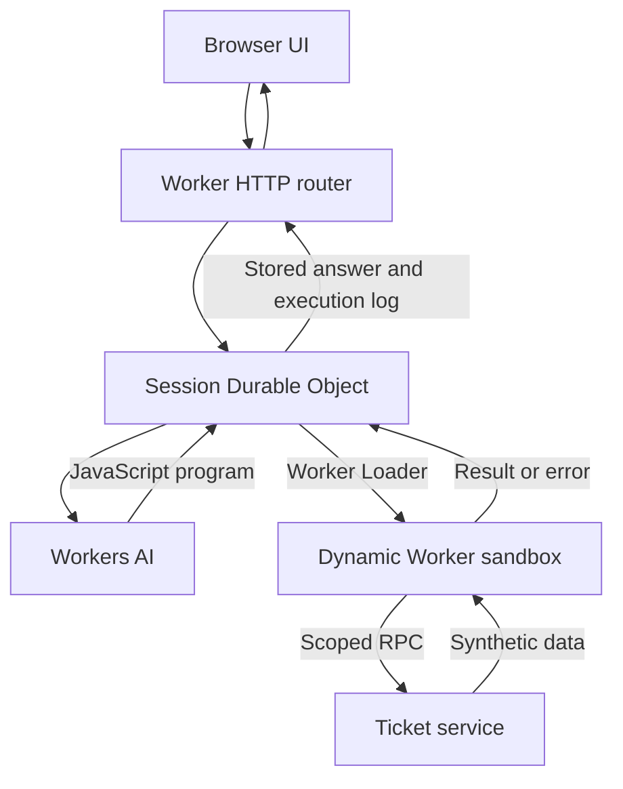

# Code Mode Lab

A small Cloudflare-native agent demo. Ask questions about 16 synthetic support tickets; a Workers AI model writes JavaScript, a Dynamic Worker executes it using a narrowly scoped ticket API, and the model summarizes the result. Conversation history and execution records live in a Durable Object.

## Current status

Implementation and deployment bundle are complete. Cloudflare rejected the attempted deployment with error 10195 because this account needs Workers Paid to use Dynamic Workers. No demo Worker was created. The existing Worker was untouched.

Workers Paid starts at $5 USD/month, with usage-based charges. Pricing: https://developers.cloudflare.com/workers/platform/pricing/ and https://developers.cloudflare.com/dynamic-workers/pricing/

## Run locally with Docker (no Cloudflare account)

Install Docker with Docker Compose, then:

```sh
git clone https://github.com/marco-machado/poc-cf-os.git
cd poc-cf-os
docker compose up --build
```

Open http://localhost:8787. If you already cloned the repository, run `git pull` first. Building requires internet access to download Node and npm dependencies. Running the fixture requires no Cloudflare credentials, paid plan, or model API key and makes no inference requests.

The footer and execution log identify local test mode. This mode uses fixed JavaScript responses in place of a language model, while executing the actual Worker, Dynamic Worker sandbox, ticket RPC service, and Durable Objects locally through Miniflare/workerd. Ordinary prompts all run the same urgent-ticket comparison; they do not receive general AI answers.

Try these prompts:

| Prompt | Expected result |
| --- | --- |
| `Compare customers` | Urgent unresolved counts: Juniper 3, Acme 2, Northstar 1, Orbit 0. |
| `recover` | A failed tool call followed by corrected code returning 16 tickets. |
| `network` | An outbound fetch rejected by the sandbox. |
| `secrets` | Sandbox binding names: only `TICKETS`. |

Fixture keywords are case-sensitive. You can submit these in the same conversation. Expand the execution log to inspect code, results, and errors.

Stop with Ctrl+C, then `docker compose down` to remove the container. Local session data is temporary: it survives page reloads while the process runs, but resets when the process restarts. The usual demo request limits still apply; local requests share the same IP budget. Restart to reset local state and budgets.

Run the integration suite in a separate, temporary container:

```sh
docker compose run --rm --no-deps demo npm test
```

If port 8787 is busy, use `LOCAL_PORT=8788 docker compose up --build` and open http://localhost:8788 (POSIX shells). Compose only exposes the server on your machine's loopback interface. Use `localhost` in your browser for the session cookie and secure browser APIs.

### Without Docker

With Node.js 22+ installed:

```sh
npm ci
npm run preview:test
```

Open http://localhost:8787. Run `npm test` for the integration suite. Optional `LOCAL_HOST` and `LOCAL_PORT` environment variables configure the fixture server; it defaults to `127.0.0.1:8787`. Stop the preview before running tests on the same port, or use `LOCAL_PORT=0 npm test` to allocate a free port.

Docker is not available in the implementation environment, so the container build itself has not been executed there. The local workerd integration suite has been verified directly.

## Run and deploy

Requires Node.js 22+ and a Cloudflare account with Workers Paid for deployment.

```sh
npm install
npm run check
npm test
npx wrangler login
npm run deploy
```

The configured Worker name is `code-mode-lab`. After deployment, Wrangler prints the URL at `https://code-mode-lab.<your-subdomain>.workers.dev`. If you rename the Worker, also update the `TICKETS` service name in `wrangler.jsonc`.

Inference uses the Workers AI binding and `@cf/qwen/qwen2.5-coder-32b-instruct`; no external provider API key is required. Workers AI provides direct inference; an AI Gateway is not required.

`npm run dev` uses Wrangler; local inference may require Cloudflare authentication. `npm run preview:test` starts an explicitly deterministic local test model. It is for testing the harness, not live inference. Test model responses identify themselves as fixtures.

## Files

- `worker.js`: HTTP router, ticket capability, Durable Object session, bounded agent loop, Dynamic Worker sandbox.
- `index.html`, `style.css`, `app.js.txt`: dependency-free responsive UI, sample-data dialog, conversation and expandable execution inspector.
- `wrangler.jsonc`: AI, loader, self-service ticket binding and SQLite Durable Object migration.
- `local-verify.mjs`, `verify.mjs`: workerd/Miniflare integration tests with deterministic model fixtures.

## Execution and controls

Each request may execute up to five programs and use at most six model calls including final synthesis. Each program receives only the TICKETS service; it does not receive the model or session bindings. `globalOutbound: null` blocks global outbound network access. CPU and subrequest limits are applied to sandbox invocations. Results are capped at 12,000 characters. Requests are capped at 2,000 characters.

The agent retries after an execution error by passing the error back to the model. Session starts are serialized. Client-generated request IDs are deduplicated. A secure HttpOnly SameSite cookie identifies a session; other sessions cannot enumerate it. Cross-origin POST requests are rejected. The last ten runs are retained in each session. A persistent global budget allows 100 requests/day, with 30/day per IP, using UTC day boundaries. This is a demo, not an authentication system. Synthetic data is public.

Sessions survive browser reloads. Mid-run durable recovery is intentionally limited: an interrupted/stale run is marked failed by an alarm and can be resubmitted; the system does not automatically resume every model/tool step. The timeout helper bounds waiting and does not cancel already-started inference.

## Validation completed

- Syntax checks and Wrangler deployment dry run passed (26.28 KiB raw bundle).
- A live Workers AI inference request succeeded through the account connector.
- Local workerd tests passed for chained tool calls and aggregation: Juniper 3, Acme 2, Northstar 1, Orbit 0 unresolved urgent tickets.
- Saved-session retrieval, separate-session isolation and duplicate request deduplication passed.
- Execution error followed by corrected code passed.
- Outbound `fetch()` was blocked by the actual runtime.
- Sandbox environment contained only TICKETS.
- Cross-origin write rejection passed.

Local harness tests use controlled model responses; they are not an end-to-end live-model evaluation. Full hosted model/sandbox integration and browser checks remain pending deployment.

## Architecture



| Component | Usage |
| --- | --- |
| Workers | Hosts the UI and HTTP API, and exposes the ticket service. |
| Workers AI | Writes JavaScript, corrects execution errors, and summarizes returned data. |
| Durable Objects | Stores session history, coordinates runs, and enforces daily budgets. |
| Worker Loader / Dynamic Workers | Runs generated code in a fresh isolate with outbound networking disabled. |
| Service bindings / RPC | Grants the generated code access only to the ticket API. |
| Wrangler | Configures, develops, and deploys the application. |

## Limitations

This is a Code Mode proof of concept, not the Cloudflare OS project or a production agent platform. It generates code per request; reusable program caching and scheduled recurring tasks are not implemented. Data is synthetic and read-only. Add authentication and appropriate operational controls before connecting company data.

Browser layout and full hosted model/sandbox integration remain unverified. The local integration suite uses a deterministic model fixture while exercising the actual workerd sandbox.
